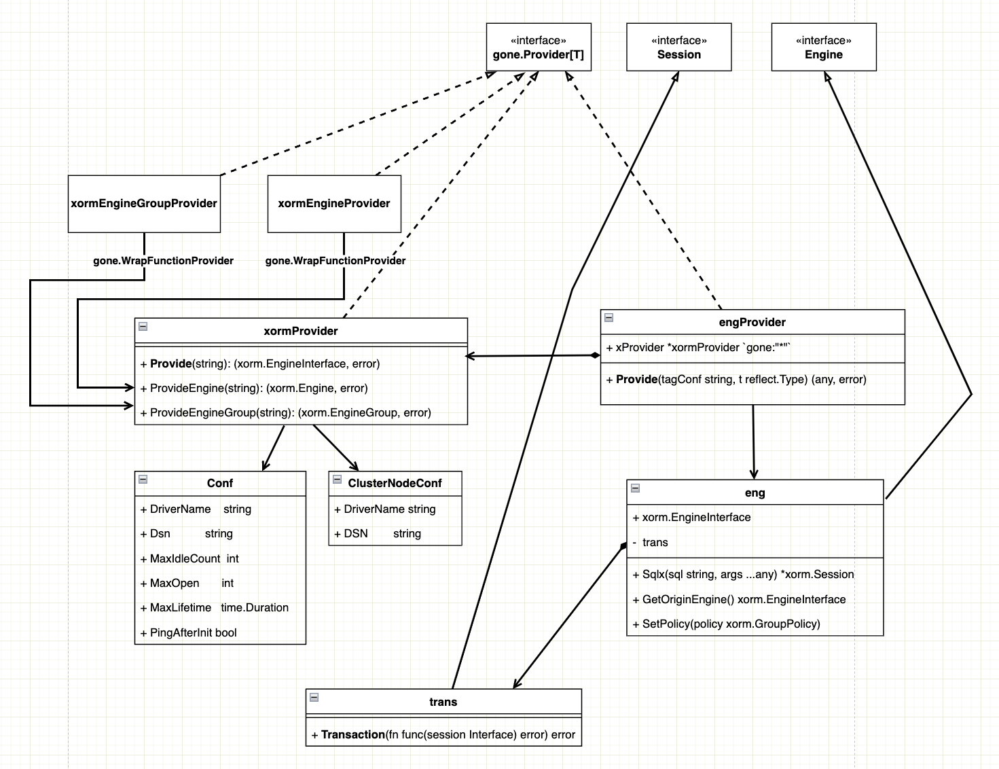

# 使用Provider机制改造goner/xorm


## 缘起

最近在给 [goner](https://github.com/gone-io/goner)增加测试代码，提高项目的测试覆盖率。改到`goner/xorm`时，发现存在两个主要问题：

### 1.原来的设计比较复杂
goner/xorm是gone框架中较早提供的组件，其演进历程如下：

- v1.0版本：完全基于Goner机制实现

- v1.2版本：引入Provider机制，为支持多数据库和集群场景做了增量改造

目前的情况是Goner机制和Provider机制的实现同时存在：

- 默认配置的数据库：基于Goner机制注入

- 集群数据库或多数据库：使用Provider机制注入

这种双机制并存的设计增加了代码的复杂性和维护难度。

### 2.测试不够友好，比较难做覆盖。
代码的设计职责不够清晰，组件边界不够分明，导致测试编写困难，难以实现良好的测试覆盖率。

<!-- truncate -->
## 目标
### 1. 保证配置兼容改造前的，保证注入方式兼容改造前的
先回顾goner/xorm的配置约定：

```yaml
# database 默认数据库配置前缀
database:
    driver-name: mysql  # 数据库驱动名称
    dsn: user:password@tcp(IP_ADDRESS:3306)/dbname?options  # 数据库连接字符串
    max-idle-count: 10  # 连接池最大空闲连接数
    max-open: 100  # 连接池最大打开连接数
    max-lifetime: 10s  # 连接最大生存时间
    show-sql: true  # 是否显示SQL语句
    cluster:  # 集群配置
        enable: false  # 是否启用集群模式
        master:  # 主库配置
            driver-name: mysql
            dsn: user:password@tcp(IP_ADDRESS:3306)/dbname?options
        slaves:  # 从库配置列表
            - driver-name: mysql
              dsn: user:password@tcp(IP_ADDRESS:3306)/dbname?options
            - driver-name: mysql
              dsn: user:password@tcp(IP_ADDRESS:3306)/dbname?options

# 自定义数据库配置前缀，custom-name 是自定义的数据库配置前缀
custom-name:
    driver-name: mysql
    dsn: user:password@tcp(IP_ADDRESS:3306)/dbname?options
    max-idle-count: 10
    max-open: 100
    max-lifetime: 10s
    show-sql: true
    cluster:
        enable: false
        master:
            driver-name: mysql
            dsn: user:password@tcp(IP_ADDRESS:3306)/dbname?options
        slaves:
            - driver-name: mysql
              dsn: user:password@tcp(IP_ADDRESS:3306)/dbname?options
            - driver-name: mysql
              dsn: user:password@tcp(IP_ADDRESS:3306)/dbname?options
```

再回顾goner/xorm的注入方式：


```go
//  默认配置前缀的数据库注入
type defaultDbUser struct {
    engine0 xorm.Engine `gone:"*"`  // 注入默认配置前缀的数据库
    engine1 xorm.Engine `gone:"xorm,master"`  // 注入默认配置数据库集群（如果开启集群模式）的 master 数据库
    engine2 []xorm.Engine `gone:"xorm"`  // 注入默认配置数据库集群（如果开启集群模式）的 slave 数据库集合
    engine3 xorm.Engine `gone:"xorm,slave=0"`  // 注入默认配置数据库集群（如果开启集群模式）的 slave 数据库集合中的第一个数据库
    engine4 xorm.Engine `gone:"xorm,slave=1"`  // 注入默认配置数据库集群（如果开启集群模式）的 slave 数据库集合中的第二个数据库
}

//  自定义配置前缀的数据库注入
type customerDbUser struct {
    engine0 xorm.Engine `gone:"xorm,db=custom-name"`  // 注入 配置前缀等于 custom-name 的数据库
    engine1 xorm.Engine `gone:"xorm,db=custom-name,master"`  // 注入 配置前缀等于 custom-name 集群（如果开启集群模式）的 master 数据库
    engine2 []xorm.Engine `gone:"xorm,db=custom-name"`  // 注入 配置前缀等于 custom-name 集群（如果开启集群模式）的 slave 数据库集合
    engine3 xorm.Engine `gone:"xorm,db=custom-name,slave=0"`  // 注入 配置前缀等于 custom-name 集群（如果开启集群模式）的 slave 数据库集合中的第一个数据库
    engine4 xorm.Engine `gone:"xorm,db=custom-name,slave=1"`  // 注入 配置前缀等于 custom-name 集群（如果开启集群模式）的 slave 数据库集合中的第二个数据库
}
```

改造后必须保持与上述配置格式和注入方式的兼容性，以确保用户代码无需更改。

### 2. 提供的功能不能改变

在功能上，goner/xorm中的Engine对xorm.io/xorm做了两个主要的增强：

#### 2.1 增强事务支持

使用github.com/jtolds/gls增强事务，更好地支持事务嵌套，无需手动传递事务上下文：
```go
var db *xorm.Engine

// 主流程处理函数，开启顶层事务
func ProcessA(){
    db.Transaction(func(session xorm.XInterface) error {
        // 调用其他事务函数，无需传递session
        ProcessB()
        ProcessC()
        return nil
    })
}

// 子流程B，自动使用父事务上下文
func ProcessB(){
    db.Transaction(func(session xorm.XInterface) error {
        ProcessD()
        return nil
    })
}

// 子流程C，自动使用父事务上下文
func ProcessC(){
    db.Transaction(func(session xorm.XInterface) error {
        // 处理具体业务逻辑
        return nil
    })
}

// 子流程D，自动使用最上层事务上下文
func ProcessD(){
    db.Transaction(func(session xorm.XInterface) error {
        // 处理具体业务逻辑
        return nil
    })
}
```

这种设计可以让开发者无需关心事务的传递，简化嵌套事务的处理。

#### 2.2 增强SQL拼接能力

使用github.com/jmoiron/sqlx增强SQL拼接能力，提供Sqlx函数：
```go
type dbUser struct {
    gone.Flag
    db xorm.Engine `gone:"*"`
}

func (s* dbUser)Query(){
    // 基本参数化SQL，使用问号占位符
    db.Sqlx("select * from user where id=?", 1).Exec()

    // 支持数组参数，会自动展开为 IN 查询
    db.Sqlx("select * from user where id in (?)", []int{1,2,3}).Exec()
    // 生成的SQL: select * from user where id in (1,2,3)

    // 支持命名参数，更直观清晰
    db.Sqlx("select * from user where id in (:id) and status = :status", map[string]any{
        "id": []int{1,2,3},
        "status": 1,
    }).Exec()
    // 生成的SQL: select * from user where id in (1,2,3) and status = 1
}
```

这种方式让SQL拼接更加灵活和安全，特别是处理复杂查询和动态条件时。

### 3. 采用v2版本的Provider机制来统一实现

改造的核心目标是统一使用一种机制（Provider机制）来实现全部功能，避免双机制并存带来的复杂性。

### 4. 优化代码设计，使职责更清晰，边界更分明

优化代码结构和组件划分，使每个组件职责单一明确，组件之间边界清晰，便于测试和维护。

## 设计
1. 编写**xormProvider**读取约定配置，为系统提供`xorm.io/xorm`的`xorm.EngineInterface`类型实例；
2. 使用`gone.WrapFunctionProvider`包装`xormProvider`，为系统提供`*xorm.Engine`和`*xorm.EngineGroup`类型实例；
3. 使用`eng` 封装`xorm.EngineInterface`，实现原来`goner/xorm`中定义的的`Engine`接口，完成事务增强和SQL拼接增强；
4. 使用`engProvider`为系统提供`goner/xorm.Engine`类型实例。



## 实现

下面是改造的核心实现代码，完整代码可在GitHub仓库查看：[完整代码](https://github.com/gone-io/goner/tree/main/xorm)。

### 1. 实现xormProvider及相关Provider
首先实现xormProvider及其封装类xormEngineProvider和xormGroupProvider，用于提供原生的xorm对象：
```go
// xorm_provide.go
package xorm

import (
    "fmt"
    "github.com/gone-io/gone/v2"
    "xorm.io/xorm"
)

type xormProvider struct {
    gone.Flag
    configure gone.Configure   `gone:"configure"`
    logger    gone.Logger      `gone:"*"`
    policy    xorm.GroupPolicy `gone:"*" option:"allowNil"`

    dbMap map[string]xorm.EngineInterface
}

func (s *xormProvider) Init() {
    s.dbMap = make(map[string]xorm.EngineInterface)
}

// ... 省略部分代码

// Provide 根据标签配置提供xorm.EngineInterface实例
func (s *xormProvider) Provide(tag string) (eng xorm.EngineInterface, err error) {
    dbName := getDbName(tag)

    if eng = s.dbMap[dbName]; eng == nil {
        eng, err = s.configAndInitDb(dbName)
        if err != nil {
            return nil, gone.ToError(err)
        }
        s.dbMap[dbName] = eng
    }
    return eng, nil
}

// configAndInitDb 根据数据库名称配置并初始化数据库连接
func (s *xormProvider) configAndInitDb(dbName string) (eng xorm.EngineInterface, err error) {
    var config Conf
    var enableCluster bool

    _ = s.configure.Get(dbName, &config, "")
    _ = s.configure.Get(dbName+".cluster.enable", &enableCluster, "false")

    if !enableCluster {
        // 创建单一数据库连接
        eng, err = xorm.NewEngine(config.DriverName, config.Dsn)
        if err != nil {
            return nil, gone.ToErrorWithMsg(err, "failed to create engine for db: "+dbName)
        }
    } else {
        // 创建数据库集群连接
        // ... 代码省略
    }

    // 配置数据库连接池和其他选项
    if config.MaxIdleCount > 0 {
        eng.SetMaxIdleConns(config.MaxIdleCount)
    }
    if config.MaxOpen > 0 {
        eng.SetMaxOpenConns(config.MaxOpen)
    }
    if config.MaxLifetime > 0 {
        eng.SetConnMaxLifetime(config.MaxLifetime)
    }
    eng.ShowSQL(config.ShowSql)
    eng.SetLogger(&dbLogger{Logger: s.logger, showSql: config.ShowSql})
    // 根据配置检测连接是否可用
    if config.PingAfterInit {
        if err = eng.Ping(); err != nil {
            return nil, gone.ToErrorWithMsg(err, "failed to ping db: "+dbName)
        }
    }
    return eng, nil
}

// 提供原生Engine实例
func (s *xormProvider) ProvideEngine(tagConf string) (*xorm.Engine, error) {
    // ... 代码省略
}

// 提供原生EngineGroup实例
func (s *xormProvider) ProvideEngineGroup(tagConf string) (*xorm.EngineGroup, error) {
    // ... 代码省略
}

// 封装函数Provider，提供*xorm.Engine
var xormEngineProvider = gone.WrapFunctionProvider(func(tagConf string, param struct {
    xormProvider *xormProvider `gone:"*"`
}) (*xorm.Engine, error) {
    return param.xormProvider.ProvideEngine(tagConf)
})

// 封装函数Provider，提供*xorm.EngineGroup
var xormGroupProvider = gone.WrapFunctionProvider(func(tagConf string, param struct {
    xormProvider *xormProvider `gone:"*"`
}) (*xorm.EngineGroup, error) {
    return param.xormProvider.ProvideEngineGroup(tagConf)
})
```

这部分代码的主要功能是解析配置文件，根据配置创建数据库连接，并提供原生的xorm引擎对象。关键点包括：

- 支持单一数据库连接和主从集群连接

- 实现配置解析和数据库连接池配置

- 提供原生的xorm.Engine和xorm.EngineGroup实例

### 2. 实现事务增强功能

接下来实现事务增强部分，提供嵌套事务支持：
```go
// trans.go
package xorm

import (
    "fmt"
    "github.com/gone-io/gone/v2"
    "github.com/jtolds/gls"
    "sync"
)

func newTrans(logger gone.Logger, newSession func() Session) trans {
    return trans{
        logger:     logger,
        newSession: newSession,
    }
}

type trans struct {
    logger     gone.Logger
    newSession func() Session
}

var sessionMap = sync.Map{}

// 获取事务会话，如果当前goroutine没有事务则创建一个新会话
func (e *trans) getTransaction(id uint) (Session, bool) {
    session, suc := sessionMap.Load(id)
    if suc {
        return session.(Session), false
    } else {
        s := e.newSession()
        sessionMap.Store(id, s)
        return s, true
    }
}

// 删除事务并关闭会话
func (e *trans) delTransaction(id uint, session Session) error {
    defer sessionMap.Delete(id)
    return session.Close()
}

// Transaction 在事务中执行SQL
func (e *trans) Transaction(fn func(session Interface) error) error {
    var err error
    gls.EnsureGoroutineId(func(gid uint) {
        session, isNew := e.getTransaction(gid)

        if isNew {
            // 当前goroutine没有活跃事务，创建新事务
            rollback := func() {
                rollbackErr := session.Rollback()
                if rollbackErr != nil {
                    e.logger.Errorf("rollback err:%v", rollbackErr)
                    err = gone.ToErrorWithMsg(err, fmt.Sprintf("rollback error: %v", rollbackErr))
                }
            }

            isRollback := false
            defer func(e *trans, id uint, session Session) {
                err := e.delTransaction(id, session)
                if err != nil {
                    e.logger.Errorf("del session err:%v", err)
                }
            }(e, gid, session)

            // 处理panic情况，确保事务回滚
            defer func() {
                if info := recover(); info != nil {
                    e.logger.Errorf("session rollback for panic: %s", info)
                    e.logger.Errorf("%s", gone.PanicTrace(2, 1))
                    if !isRollback {
                        rollback()
                        err = gone.NewInnerError(fmt.Sprintf("%s", info), gone.DbRollForPanicError)
                    } else {
                        err = gone.ToErrorWithMsg(info, fmt.Sprintf("rollback for err: %v, but panic for", err))
                    }
                }
            }()

            // 开始事务
            err = session.Begin()
            if err != nil {
                err = gone.ToError(err)
                return
            }

            // 执行用户函数
            err = gone.ToError(fn(session))
            if err == nil {
                // 事务提交
                err = gone.ToError(session.Commit())
            } else {
                // 事务回滚
                e.logger.Errorf("session rollback for err: %v", err)
                isRollback = true
                rollback()
            }
        } else {
            // 当前goroutine已有活跃事务，复用现有事务
            err = gone.ToError(fn(session))
        }
    })
    return err
}
```

事务增强的核心是通过goroutine本地存储(gls)实现，这样可以：

- 在同一goroutine中自动共享事务上下文

- 支持嵌套事务调用，内层事务函数自动使用外层事务

- 提供统一的错误处理和回滚机制

### 3. 实现Engine封装

然后实现eng结构体，封装原生的xorm接口并增强功能：

```go
//eng.go
package xorm

import (
    "github.com/gone-io/gone/v2"
    "xorm.io/xorm"
)

func newEng(xEng xorm.EngineInterface, logger gone.Logger) *eng {
    e := eng{EngineInterface: xEng}
    e.trans = newTrans(logger, func() Session {
        return e.NewSession()
    })
    return &e
}

type eng struct {
    xorm.EngineInterface  // 嵌入原生xorm接口
    trans                 // 嵌入事务增强功能
}

// 获取原始引擎实例
func (e *eng) GetOriginEngine() xorm.EngineInterface {
    return e.EngineInterface
}

// 设置主从策略
func (e *eng) SetPolicy(policy xorm.GroupPolicy) {
    if group, ok := e.EngineInterface.(*xorm.EngineGroup); ok {
        group.SetPolicy(policy)
    }
}

// 增强的SQL拼接功能
func (e *eng) Sqlx(sql string, args ...any) *xorm.Session {
    sql, args = sqlDeal(sql, args...)
    return e.SQL(sql, args...)
}
```

这个封装层实现了：

- 嵌入原生xorm接口保持API兼容

- 集成事务增强功能

- 添加SQL拼接增强功能

### 4. 实现Engine提供者

最后，实现engProvider为应用提供增强版的Engine实例：
```go
//eng_provider.go
package xorm

import (
    "github.com/gone-io/gone/v2"
    "github.com/spf13/cast"
    "reflect"
)

type engProvider struct {
    gone.Flag
    logger    gone.Logger   `gone:"*"`
    xProvider *xormProvider `gone:"*"`
}

func (s *engProvider) GonerName() string {
    return "xorm" // 注册为xorm名称
}

// 提供实例，根据类型和配置提供不同的实例
func (s *engProvider) Provide(tagConf string, t reflect.Type) (any, error) {
    switch t {
    case xormInterfaceSlice: // 提供Engine切片
        group, err := s.xProvider.ProvideEngineGroup(tagConf)
        if err != nil {
            return nil, gone.ToError(err)
        }
        slaves := group.Slaves()
        engines := make([]Engine, 0, len(slaves))
        for _, slave := range slaves {
            engines = append(engines, newEng(slave, s.logger))
        }
        return engines, nil
    case xormInterface: // 提供单一Engine
        return s.ProvideEngine(tagConf)
    default:
        return nil, gone.NewInnerErrorWithParams(gone.GonerTypeNotMatch, "Cannot find matched value for %q", gone.GetTypeName(t))
    }
}

// 根据标签配置提供Engine实例
func (s *engProvider) ProvideEngine(tagConf string) (Engine, error) {
    m, _ := gone.TagStringParse(tagConf)

    // 处理master标记
    if v, ok := m[masterKey]; ok && (v == "" || cast.ToBool(v)) {
        group, err := s.xProvider.ProvideEngineGroup(tagConf)
        if err != nil {
            return nil, gone.ToError(err)
        }
        return newEng(group.Master(), s.logger), nil
    }

    // 处理slave标记
    if index, ok := m[slaveKey]; ok {
        i := cast.ToInt(index)
        group, err := s.xProvider.ProvideEngineGroup(tagConf)
        if err != nil {
            return nil, gone.ToError(err)
        }
        slaves := group.Slaves()
        if i < 0 || i >= len(slaves) {
            return nil, gone.ToError("slave index out of range")
        }
        return newEng(slaves[i], s.logger), nil
    }

    // 提供默认引擎
    provideEngine, err := s.xProvider.Provide(tagConf)
    if err != nil {
        return nil, gone.ToError(err)
    }
    return newEng(provideEngine, s.logger), nil
}
```


这个Provider实现了：

- 将自身注册为"xorm"名称，与原来的注入标签保持一致；

- 能够提供单个Engine实例或Engine切片；

- 根据标签配置提供主库、从库或默认数据库实例；

- 使用newEng包装原生引擎实例，增强其功能。

## 测试

### 测试覆盖率
测试是验证改造成功的关键环节。通过编写全面的测试用例，我们不仅能验证功能正确性，还能提高代码的测试覆盖率。

测试覆盖率

如图所示，改造后的代码测试覆盖率得到了显著提升。


### 下面是部分测试代码，展示了如何测试xormProvider：

```go
// xorm_provider_test.go
package xorm

import (
    "database/sql"
    "github.com/DATA-DOG/go-sqlmock"
    "github.com/gone-io/gone/v2"
    "github.com/stretchr/testify/assert"
    "os"
    "testing"
    "xorm.io/xorm"
)

func Test_xormProvider_Init(t *testing.T) {
    // 创建SQL模拟器，用于模拟数据库操作而无需真实数据库
    db, mock, _ := sqlmock.NewWithDSN(
        "root@/blog",
        sqlmock.MonitorPingsOption(true),
    )
    defer db.Close()

    // 注册模拟的数据库驱动
    drivers := sql.Drivers()
    if !contains(drivers, "mysql") {
        sql.Register("mysql", db.Driver())
    }

    // 定义测试用例结构
    type Tests struct {
        name        string
        before      func()         // 测试前准备
        after       func()         // 测试后清理
        exceptPanic bool           // 是否期望发生panic
        injectFn    any            // 依赖注入测试函数
    }

    tests := []Tests{
        {
            name: "inject default db failed",
            before: func() {
                // 设置错误的驱动名称，预期会失败
                _ = os.Setenv("GONE_DATABASE", `{
                    "driver-name":"error",
                    "dsn": "root@/blog",
                    "max-idle-count": 5,
                    "max-open": 10,
                    "max-lifetime": 10000,
                    "show-sql": true,
                    "ping-after-init": true
                }`)
            },
            after: func() {
                _ = os.Unsetenv("GONE_DATABASE")
            },
            injectFn: func(in struct {
                db *xorm.Engine `gone:"*"`
            }) {
                assert.NotNil(t, db)
            },
            exceptPanic: true, // 预期会发生panic
        },
        
        // ... 更多测试用例
        
        {
            name: "inject default db",
            before: func() {
                // 设置正确的数据库配置
                _ = os.Setenv("GONE_DATABASE", `{
                    "driver-name":"mysql",
                    "dsn": "root@/blog",
                    "max-idle-count": 5,
                    "max-open": 10,
                    "max-lifetime": 10000,
                    "show-sql": true,
                    "ping-after-init": true
                }`)
                mock.ExpectPing() // 期望执行ping操作
            },
            after: func() {
                _ = os.Unsetenv("GONE_DATABASE")
            },
            injectFn: func(in struct {
                db1      *xorm.Engine         `gone:""`
                db2      *xorm.Engine         `gone:"*"`
                db       xorm.EngineInterface `gone:"*"`
                injector gone.StructInjector  `gone:"*"`
            }) {
                // 验证注入的实例是否符合预期
                assert.NotNil(t, in.db1)
                assert.NotNil(t, in.db2)
                assert.Equal(t, in.db1, in.db2)
                assert.Equal(t, in.db1, in.db)

                // 尝试注入不兼容的类型，预期会失败
                var x struct {
                    db *xorm.EngineGroup `gone:"*"`
                }
                err := in.injector.InjectStruct(&x)
                assert.Error(t, err)
            },
            exceptPanic: false, // 不期望发生panic
        },
        
        // ... 更多测试用例
    }

    // 执行所有测试用例
    for _, tt := range tests {
        t.Run(tt.name, func(t *testing.T) {
            tt.before()
            defer tt.after()

            func() {
                defer func() {
                    err := recover()
                    if tt.exceptPanic {
                        assert.Error(t, err.(error))
                    } else {
                        assert.Nil(t, err)
                    }
                }()

                // 启动应用并执行测试函数
                gone.
                    NewApp().
                    Load(&xormProvider{}).
                    Load(xormEngineProvider).
                    Load(xormGroupProvider).
                    Run(tt.injectFn)
            }()
        })
    }
}
```

这段测试代码使用了多种测试技巧：

1. SQL模拟：使用sqlmock库模拟数据库操作，无需真实数据库即可进行测试

2. 环境变量配置：通过设置环境变量模拟不同的配置场景

3. 依赖注入测试：利用gone框架的依赖注入系统验证各种注入场景

4. 异常测试：通过recover捕获并验证预期的panic情况

5. 组件交互测试：测试不同组件之间的交互行为

通过这些测试用例，我们可以全面验证改造后的功能是否正常工作，同时提高代码的测试覆盖率。

## 总结

通过这次改造，我们成功地：

1. 统一了xorm组件的实现机制，全部采用Provider机制，简化了代码结构

2. 保持了与原有配置和注入方式的兼容性，确保用户代码无需更改

3. 保留并增强了原有功能，包括事务管理和SQL拼接能力

4. 重构了代码结构，使各组件职责更加清晰，边界更加分明

5. 提高了代码的可测试性，显著提升了测试覆盖率

这次改造不仅提高了代码质量，还为未来的功能扩展和维护奠定了良好基础。通过合理采用设计模式和分层架构，我们可以在保持兼容性的同时，不断优化和演进系统。