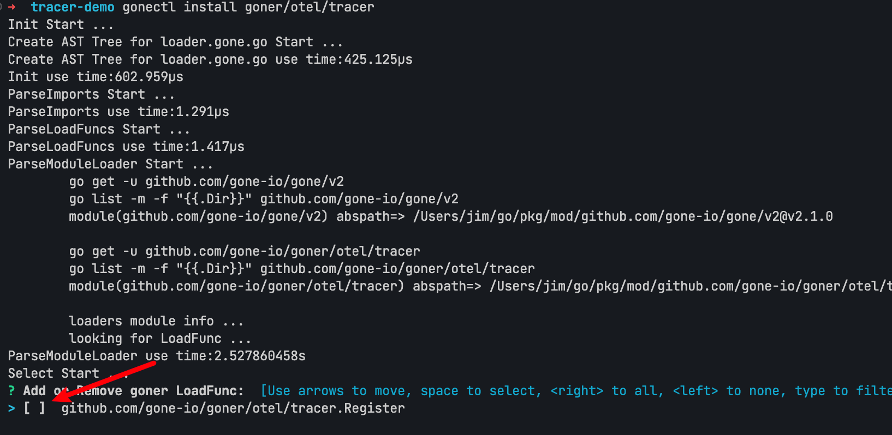
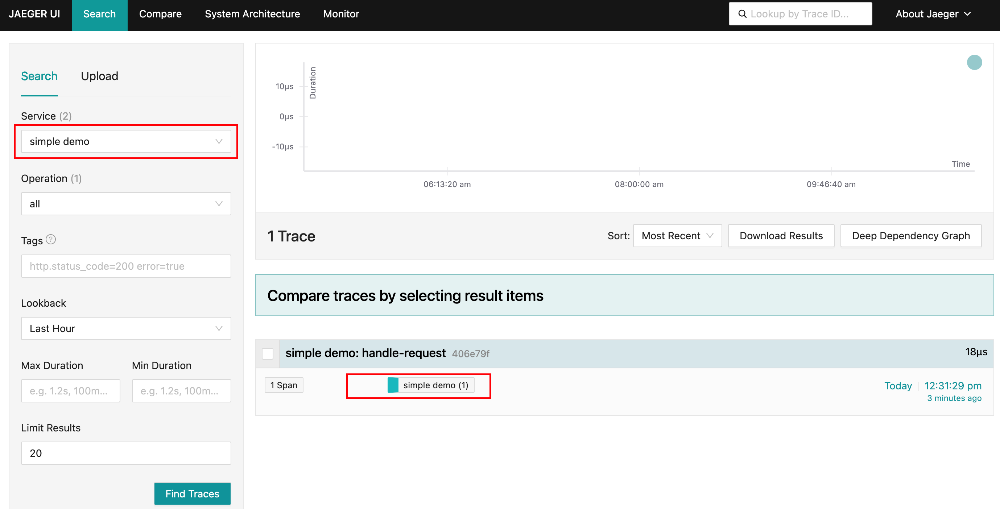
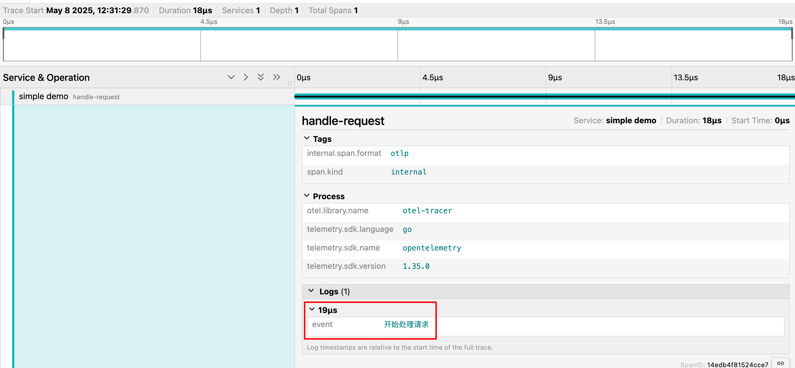

# goner/otel 在Gone框架接入OpenTelemetry

## 背景与意义
[OpenTelemetry](https://opentelemetry.io/) 是当前云原生领域事实标准的可观测性框架，支持分布式追踪、指标和日志的采集与导出。它帮助开发者在微服务架构下快速定位问题、分析性能瓶颈。

[Gone框架](https://github.com/gone-io/gone) 是一个基于Go语言的依赖注入框架，专注于简化服务注册、依赖管理和组件解耦。[goner](https://github.com/gone-io/goner) 是Gone生态下的组件库，提供了日志、配置、数据库、缓存等常用能力。

将 OpenTelemetry 与 Gone 框架结合，可以让你的微服务天然具备分布式追踪能力，极大提升系统可观测性和运维效率。

本文将详细介绍如何通过 [goner/otel](https://github.com/gone-io/goner/tree/main/otel) 组件，在 Gone 框架中优雅集成 OpenTelemetry，并给出实用代码示例、常见问题解答及最佳实践。

## 快速上手：五步集成 OpenTelemetry


1. 安装 gonectl 脚手架工具：
```bash
go install github.com/gone-io/gonectl@latest
```
2. 创建基于 otel/tracer 模板的示例项目：
```bash
gonectl create -t otel/tracer/simple tracer-demo
cd tracer-demo
```
3. 拉取依赖：
```bash
go mod tidy
```
4. 运行示例：
```bash
go run .
```
5. 查看控制台输出的追踪信息。

> 你也可以在已有 Gone 项目中直接安装 otel 组件：
> ```bash
> gonectl install goner/otel/tracer
> ```

## 运行效果展示

执行后你将在控制台看到类似如下的追踪数据（已简化）：
```json5
{
  "Name": "handle-request",
  "SpanContext": {
    "TraceID": "...",
    "SpanID": "..."
  },
  "Events": [
    { "Name": "开始处理请求" }
  ],
  "Resource": [
    { "Key": "service.name", "Value": { "Value": "simple demo" } },
    { "Key": "telemetry.sdk.language", "Value": { "Value": "go" } }
  ]
}
```
你可以将数据导出到 Jaeger、Zipkin、Prometheus 等后端进行可视化分析。
## 代码详解与实践

### 目录结构说明
```bash
tracer-demo/
├── go.mod           # Go module 文件
├── go.sum           # 依赖校验
├── main.go          # 程序入口
├── module.load.go   # 组件加载入口（自动生成）
├── README_CN.md     # 中文说明
├── README.md        # 英文说明
└── your_component.go# 业务组件示例
```

### 组件加载（module.load.go）
该文件由 gonectl 自动生成，用于注册和加载 goner/otel/tracer 组件：
```go
// Code generated by gonectl. DO NOT EDIT.
package main
import (
  "github.com/gone-io/gone/v2"
  "github.com/gone-io/goner/g"
  "github.com/gone-io/goner/otel/tracer"
)
var loaders = []gone.LoadFunc{
  tracer.Register,
}
func GoneModuleLoad(loader gone.Loader) error {
  var ops []*g.LoadOp
  for _, f := range loaders {
    ops = append(ops, g.F(f))
  }
  return g.BuildOnceLoadFunc(ops...)(loader)
}
```

### 业务组件示例（your_component.go）
```go
package main
import (
  "context"
  "github.com/gone-io/gone/v2"
  "go.opentelemetry.io/otel/trace"
)
type YourComponent struct {
  gone.Flag
  tracer trace.Tracer `gone:"*,otel-tracer"` // 注入 OpenTelemetry Tracer
}
func (c *YourComponent) HandleRequest(ctx context.Context) {
  tracer := c.tracer
  ctx, span := tracer.Start(ctx, "handle-request")
  defer span.End()
  span.AddEvent("开始处理请求")
  // ...业务逻辑...
}
```

### 程序入口（main.go）
```go
package main
import (
  "context"
  "github.com/gone-io/gone/v2"
  "os"
)
func main() {
  _ = os.Setenv("GONE_OTEL_SERVICE_NAME", "simple demo") // 设置服务名称
  gone.
    Loads(GoneModuleLoad).
    Load(&YourComponent{}).
    Run(func(c *YourComponent) {
      c.HandleRequest(context.Background())
    })
}
```

## 进阶用法与最佳实践

### 使用 goner/viper 读取配置
- 安装 goner/viper 组件：

```bash
gonectl install goner/viper
```
- 增加配置文件： config/default.yaml
配置文件内容：
```yaml
otel:
    service:
        name: simple demo
```

- 去掉main.go中设置服务名称的代码：
```go
//...
func main() {
//   _ = os.Setenv("GONE_OTEL_SERVICE_NAME", "simple demo") // 设置服务名称
// ...
}
```

### 使用OLTP/HTTP将链路追踪数据发送至 Jaeger
如果觉着控制台看的 span 不够直观，可以选择将链路追踪的数据发送至 Jaeger，通过 Jaeger UI 查看。

#### 启动 Jaeger
Jaeger 官方提供的 all-in-one 是为快速本地测试而设计的可执行文件。它包括 Jaeger UI、jaeger-collector、jaeger-query 和 jaeger-agent，以及一个内存存储组件。

启动 all-in-one 的最简单方法是使用发布到 DockerHub 的预置镜像（只需一条命令行）。
```bash
docker run --rm --name jaeger \
  -e COLLECTOR_ZIPKIN_HOST_PORT=:9411 \
  -p 6831:6831/udp \
  -p 6832:6832/udp \
  -p 5778:5778 \
  -p 16686:16686 \
  -p 4317:4317 \
  -p 4318:4318 \
  -p 14250:14250 \
  -p 14268:14268 \
  -p 14269:14269 \
  -p 9411:9411 \
  jaegertracing/all-in-one:1.55
```
然后你可以使用浏览器打开 [http://localhost:16686](http://localhost:16686) 访问Jaeger UI。

容器公开以下端口：

| 端口  | 协议   | 组件      | 功能说明 |
|-------|--------|-----------|-------------------------------------------------------------|
| 6831  | UDP    | agent     | 接收 jaeger.thrift（Thrift-compact，主流 SDK 使用）         |
| 6832  | UDP    | agent     | 接收 jaeger.thrift（Thrift-binary，Node.js SDK 使用）        |
| 5775  | UDP    | agent     | （已废弃）接收 zipkin.thrift（Thrift-compact，旧版客户端）  |
| 5778  | HTTP   | agent     | 提供配置（采样等）                                           |
| 16686 | HTTP   | query     | 提供前端 UI                                                  |
| 4317  | HTTP   | collector | 接收 OTLP（gRPC 协议）                                       |
| 4318  | HTTP   | collector | 接收 OTLP（HTTP 协议）                                       |
| 14268 | HTTP   | collector | 直接接收 jaeger.thrift 客户端数据                            |
| 14250 | HTTP   | collector | 接收 model.proto                                             |
| 9411  | HTTP   | collector | Zipkin 兼容端点（可选）                                      |

我们这里使用 HTTP 协议的4318 端口上报链路追踪数据。

#### 上报至 Jaeger
1. 安装`goner/otel/tracer/http` 组件：
```bash
gonectl install goner/otel/tracer/http
```

2. 在配置文件中添加tracer的配置内容：
```yaml
otel:
    service:
        name: simple demo
    # 新增以下配置
    tracer:
        http:
            endpoint: localhost:4318
            insecure: true
```
3. 移除`goner/otel/tracer`组件，执行`gonectl install goner/otel/tracer`命令，去掉`goner/otel/tracer`的勾选：


4. 运行demo项目：`go run .`，这次链路信息没有打印到控制台，而是被发送到了Jaeger，所以看到程序直接退出了。

#### 在Jaeger UI 查看链路数据
打开浏览器，访问 [Jaeger UI 查看链路数据
打开Jaeger UI 查看链路数据
打开浏览器，访问 [http://localhost:16686](http://localhost:16686)：




### 常见问题解答（FAQ）

#### 1. 为什么集成 goner/otel 后没有看到任何追踪数据输出？
- 请确认已正确安装并加载 `goner/otel/tracer` 组件。
- 检查 `main.go` 是否设置了服务名称（如通过环境变量 `GONE_OTEL_SERVICE_NAME` 或配置文件）。
- 若使用 HTTP 上报至 Jaeger，需确保 Jaeger 服务已启动且 endpoint 配置正确。

#### 2. Jaeger UI 没有显示任何链路数据怎么办？
- 请确认 Jaeger 容器已启动且端口（如 4318、16686）未被占用。
- 检查配置文件中的 `otel.tracer.http.endpoint` 是否为 Jaeger 的 HTTP 采集端口（通常为 `localhost:4318`）。
- 若为远程 Jaeger，请确保网络连通。

#### 3. 如何自定义 Trace 的服务名？
- 推荐通过配置文件 `otel.service.name` 设置服务名，或设置环境变量 `GONE_OTEL_SERVICE_NAME`。
- 若两者都未设置，默认服务名可能为 `unknown-service`。

#### 4. 控制台和 Jaeger 都没有数据，如何排查？
- 检查依赖是否拉取完整（`go mod tidy`）。
- 查看是否有 panic 或初始化错误日志。
- 可尝试将日志级别调高，观察详细输出。

#### 5. 如何同时输出到控制台和 Jaeger？
- 当前 goner/otel/tracer 支持单一导出目标，建议优先选择 Jaeger 进行链路分析。
- 如需多目标导出，可参考 OpenTelemetry 官方文档自定义 exporter 和 [goner/otel/tracer 文档](https://github.com/gone-io/goner/blob/main/otel/tracer/README_CN.md#%E8%87%AA%E5%AE%9A%E4%B9%89%E5%AF%BC%E5%87%BA%E5%99%A8)。

#### 6. Jaeger 采集到的数据不全或丢失？
- 检查采样配置，默认通常为全采样。
- 确认 Jaeger 容器资源充足，避免因内存不足丢失数据。

#### 7. 如何在业务代码中添加自定义事件或属性？
- 使用 `span.AddEvent("事件名")` 添加事件。
- 使用 `span.SetAttributes()` 添加自定义属性。

#### 8. goner/otel 支持哪些后端？
- 支持控制台、Jaeger、Zipkin、Prometheus 等主流可观测性后端。
- 具体支持情况请参考 [goner/otel 官方文档](https://github.com/gone-io/goner/tree/main/otel)。


### 参考资料与扩展阅读
- [OpenTelemetry 官方文档](https://opentelemetry.io/docs/)
- [Gone 框架 GitHub](https://github.com/gone-io/gone)
- [goner 组件库](https://github.com/gone-io/goner)
- [gonectl 脚手架](https://github.com/gone-io/gonectl)
- [Jaeger 可观测性平台](https://www.jaegertracing.io/)

---

通过上述实践，你可以在 Gone 框架下快速集成 OpenTelemetry，提升微服务的可观测性和诊断能力。如有疑问，欢迎在 GitHub 提 Issue 交流。